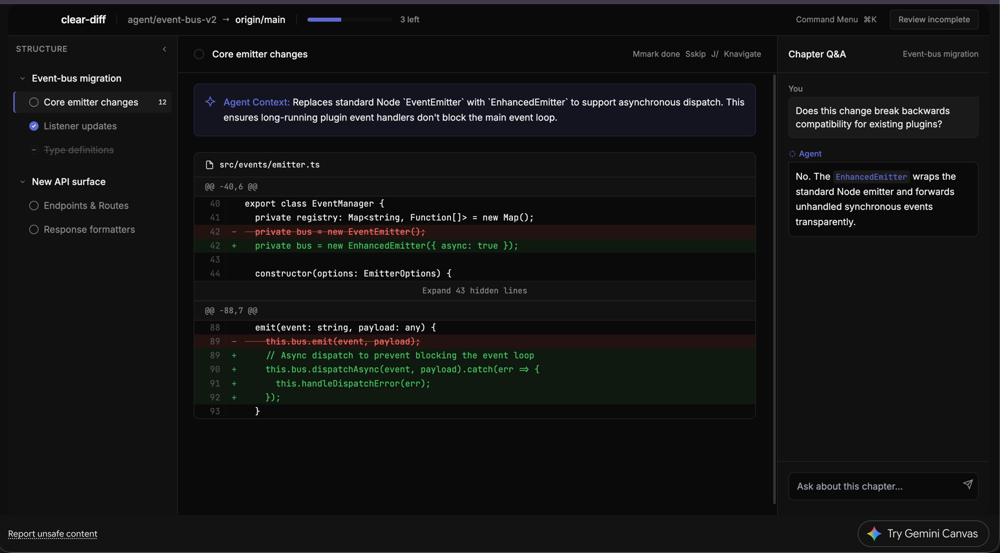
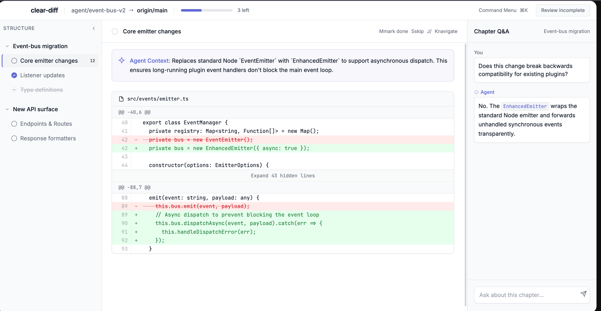

# cara — Initial Design Prototypes

First interactive prototypes of the reviewer UI (dark + light), built in Gemini Canvas as throwaway HTML. The HTML itself isn't kept; this doc captures everything concrete it established so the design can be rebuilt exactly, **not** re-derived from the screenshots. Values below are transcribed verbatim from the prototype source.

These are a **starting point**, not a spec. Where they diverge from the agreed model, the [design brief](../design-brief.md), [concept](../concept.md), and ADRs win — see [Divergences](#divergences-already-reconciled).

## Screenshots

- Dark mode: [`prototypes/dark-mode.png`](prototypes/dark-mode.png)
- Light mode: [`prototypes/light-mode.png`](prototypes/light-mode.png)
- Live source: [Gemini design session](https://gemini.google.com/app/5a65fe3f9b8dcbfb) — iterations continue here beyond these stills (e.g. the **Done & Next** button and `D` binding below).




---

## Design tokens

Both modes share one accent (`#5E6AD2`, Linear's indigo) and the same type system; only the neutral and diff palettes differ.

### Colour

| Token | Dark | Light |
|---|---|---|
| `bgMain` | `#0A0A0A` | `#FFFFFF` |
| `bgPanel` | `#111111` | `#F9FAFB` |
| `bgHover` | `#1A1A1A` | `#F3F4F6` |
| `border` | `#222222` | `#E5E7EB` |
| `accent` | `#5E6AD2` | `#5E6AD2` |
| `accentHover` | `#6F7BF7` | `#4A55C0` |
| `textMain` | `#EDEDED` | `#111827` |
| `textMuted` | `#888888` | `#6B7280` |
| `diffAddBg` | `rgba(46,160,67,0.15)` | `#E6FFEC` |
| `diffAddBgHover` | `rgba(46,160,67,0.15)`¹ | `#CCFFD8` |
| `diffAddText` | `#46C05E` | `#1A7F37` |
| `diffRemBg` | `rgba(248,81,73,0.15)` | `#FFEBE9` |
| `diffRemBgHover` | `rgba(248,81,73,0.15)`¹ | `#FFDCE0` |
| `diffRemText` | `#FF6A65` | `#CF222E` |
| scrollbar thumb | `#333` (hover `#555`) | `#D1D5DB` (hover `#9CA3AF`) |
| selection | `bg accent` / `text white` | `bg accent` / `text white` |

¹ Dark didn't define a separate hover; add/remove rows used inline `rgba(…,0.1)` base and `rgba(…,0.15)` hover. The light palette named explicit hover tokens. **To reconcile:** define `diffAddBgHover` / `diffRemBgHover` for both modes.

### Typography

- **Sans (UI):** `Inter, -apple-system, BlinkMacSystemFont, "Segoe UI", Roboto, sans-serif` — weights **400, 500, 600**.
- **Mono (code, line numbers, hunk headers, counts, `kbd`):** `"JetBrains Mono", Menlo, Monaco, "Courier New", monospace` — weights **400, 500**.
- Loaded from Google Fonts: `Inter:wght@400;500;600` and `JetBrains+Mono:wght@400;500`. (Production should self-host, not CDN.)

Sizes in use (Tailwind classes, transcribed):

| Element | Size / style |
|---|---|
| Diff lines | `13px`, `leading-relaxed`, mono |
| Body / chat / section title / nav rows | `text-sm` (14px) |
| File header, hunk header, key hints, "N left" | `text-xs` (12px) |
| `kbd` keycaps, count badges, section labels | `text-[10px]` |
| Brand wordmark | `font-semibold tracking-tight` |
| "STRUCTURE" / "ACTIONS" labels | `text-xs`/`text-[10px]` `font-medium`/`font-semibold` `uppercase tracking-wider` |

### Radii, borders, elevation

- Radii: `rounded` (keycaps, small), `rounded-lg` (summary band, file cards, chat bubbles, palette rows), `rounded-xl` (command palette), `rounded-full` (progress bar, mark glyphs).
- Borders: hairline `1px` in `border` token throughout; panes separated by single borders, not shadows.
- Elevation: minimal. Light mode adds `shadow-sm` on cards/bubbles/inputs; dark mode is near-flat. Palette uses `shadow-2xl`. Sticky headers use `backdrop-blur-sm`.

### Motion

- `transition-colors` on interactive hovers; `transition-opacity` on reveal-on-hover affordances; `transition-transform` on the chapter chevron.
- `duration-200` for state changes (mark, block-tick dim), `duration-300` for the progress bar fill.
- Command palette / overlay fade via `backdrop-blur-sm`. No decorative motion.

---

## Layout

Fixed 3-pane shell. Dimensions transcribed:

```
┌─ header  h-12 (48px) ────────────────────────────────────────────────┐
│ brand (pl-16, clears macOS traffic lights) · context · progress · ⌘K · Go │
├─ nav w-64 ──┬─ diff  flex-1 ──────────────────┬─ chat w-80 ───────────┤
│ (256px)     │  section header h-14 (56px)      │ (320px)               │
│ STRUCTURE   │  AI summary band                 │ Chapter Q&A header h-14│
│ Chapter     │  file card                       │ messages (scroll)     │
│   Section…  │   hunk header  @@ -40,6 @@        │                       │
│             │   diff lines (atom/gap/atom)      │ input (textarea)      │
└─────────────┴──────────────────────────────────┴───────────────────────┘
```

- **Header** `h-12`, `px-4`. Brand has `pl-16` to clear the macOS traffic-light controls. Divider pills (`w-px` border) separate brand / context / progress.
- **Progress** — bar `w-32 h-1.5 rounded-full`, accent fill, + "`<n>` left" in `text-xs textMuted`.
- **Nav pane** `w-64`, `bgPanel`, right border. "STRUCTURE" label row with a collapse chevron. Tree: Chapter header rows (`text-sm font-medium`, rotating chevron) → Section rows (`pl-6`, mark glyph + title + hover-revealed count).
- **Active Section row** — `bgHover` + left accent bar via `shadow-[inset_2px_0_0_0_#5E6AD2]`.
- **Diff pane** `flex-1`. Sticky section header (`h-14`, `px-6`, `backdrop-blur`) shows the active Section's mark glyph + title, and a right-aligned action row: a **Done** toggle (`D`), **Skip** (`S`), and `J`/`K` nav hints. Content area `pb-32`, with a **Done & Next** CTA button (`D`) below the diff.
- **Chat pane** `w-80`, `bgPanel`, left border. Header `h-14` ("Chapter Q&A" + current chapter name). Scrolling messages, then a bottom `textarea` (`rows=1`, send button) with `focus:ring-1 focus:ring-accent`.
- **Command palette** — centered modal `w-[500px]`, `pt-[15vh]`, `rounded-xl`, `shadow-2xl`, dimmed blurred backdrop. Search input row (search icon + `ESC` keycap) over a grouped, scrollable results list (`max-h-[300px]`), each row = action label + its shortcut keycap.

---

## Components & states

- **Mark glyphs** (`w-3.5` nav, `w-4` section header):
  - *unreviewed* — empty ring (`border`).
  - *done* — filled `accent` circle + white check.
  - *skipped* — dashed ring + short centre dash; row title `line-through opacity-50`.
- **AI summary band** — accent-tinted card (`bg-accent/10` dark, `bg-accent/5` light; `border-accent/20`), sparkle icon, "Agent Context:" lead + prose. Heads the Section above the diff. *(See divergences: rename + per-Chapter.)*
- **File card** — bordered `rounded-lg`; sticky mono file header with a file icon.
- **Hunk header** — mono `@@ -<start>,<len> @@`, on a tinted bar; hover reveals a **review tick** ("Mark Reviewed" → "Atom Reviewed" when set). Clicking it toggles that block.
- **Ticked block** — whole block goes `opacity-40 grayscale`.
- **Gap** — full-width "Expand `<n>` hidden lines" bar between hunks, `text-xs` centred, non-selectable.
- **Diff line** — `w-12` line-number gutter (right-aligned, dimmed) · `w-6` sign column (`+`/`-`/space) · code. Added: add bg + `diffAddText`. Removed: rem bg + `diffRemText` + `line-through`. *(See divergences: drop strikethrough.)*
- **Chat bubbles** — "You" (raised bg, `rounded-tr-none`) vs "Agent" (with ray icon, `rounded-tl-none`); inline code chips for identifiers.
- **Done controls** — a **Done** toggle in the section-header action row and a prominent accent **Done & Next** button below the diff; both bound to `D` (mark done + advance). Standardise on the **tick (✓) glyph** across both (the prototype's bottom button still shows an arrow — see divergences).
- **Go button** — final dispatch, distinct from Done. Two states: disabled-looking "Review incomplete" (muted) → accent "Go (Dispatch)" once `unreviewed === 0`.

---

## Keyboard map (as prototyped)

| Key | Action |
|---|---|
| `⌘K` / `Ctrl-K` | Toggle command palette |
| `Esc` | Close palette |
| `j` | Next Section |
| `k` | Previous Section |
| `d` | Mark Section done & advance ("Done & Next") |
| `s` | Skip Section |
| click hunk header | Toggle that block reviewed |

- While focus is in an `INPUT`/`TEXTAREA`, hot-keys are suppressed (only `Esc` closes the palette).
- Marking a Section **auto-advances** to the next still-unreviewed Section.
- Block-ticking every block in a Section **auto-completes** it (flips the Section to done).

These are the prototype's bindings only. The full keyboard model (remappable, palette-shown, vim `j/k` + arrows, comment/open-file/toggle-pane keys) lives in the [design brief](../design-brief.md).

---

## Data shape (implied backend → UI contract)

The prototype's mock data is a useful first sketch of what the backend hands the UI (structured atoms + grouping, never rendered HTML — per [ADR-0003](../adr/0003-hexagonal-architecture.md)):

```js
// grouping (agent overlay) + per-section state
reviewData = {
  chapters: [{
    id, title,
    sections: [{ id, title, state: 'unreviewed'|'done'|'skipped', changes: <n>, summary?: <string> }]
  }]
}

// evidence (git truth), keyed by section id
diffMockData = {
  [sectionId]: [{
    file,
    blocks: [
      { type: 'hunk', startLine, lines: [{ num, type: 'ctx'|'add'|'rem', text }] },
      { type: 'gap', hiddenLines: <n> }
    ]
  }]
}

// review state, keyed per block
atomStates = { [`${sectionId}-${file}-${blockIndex}`]: <bool> }
```

Real implementation differs (atom identity is a content hash, not an index-based `blockId`; counts come from the canonical master list, per ADR-0002 and ADR-0004). But the *shape* matches the architecture: grouping separate from evidence, marks keyed to blocks.

---

## Divergences already reconciled

Captured so they aren't reintroduced from the prototype:

- **"Atom" must never surface.** The prototype's "Atom Reviewed" / "Mark Reviewed" → use "Reviewed" / "Mark reviewed". Users only see Chapters and Sections.
- **AI summary stays, reframed.** Allowed and wanted, but as an explicitly untrusted "AI summary" aid (pinch of salt), per Section **and** per Chapter — never authoritative, never a substitute for the diff. ADR-0004 refined to permit it.
- **Strikethrough on removed lines — drop it.** The `+`/`-` signs already give the non-colour cue; strikethrough hurts code legibility.
- **Mark-done key is `D`** (the first prototype used `m`). Pairs cleanly with `S` for skip.
- **Tick, not arrow, on both Done controls.** The header **Done** uses a tick; the **Done & Next** button still shows an arrow in the prototype — standardise both on the tick (✓) so the action reads identically.
- **Panes must be resizable + collapsible** with persisted sizes. The prototype's widths are fixed and its collapse chevrons are decorative.
- **Headline counter** should read changes-left from the master list, not Sections-left (the prototype mixes "3 left" Sections with per-row change counts).
- **Tech:** Tailwind-CDN + `@apply`-in-`<style>` is prototype-only; production is Vite (ADR-0003) with self-hosted fonts.
